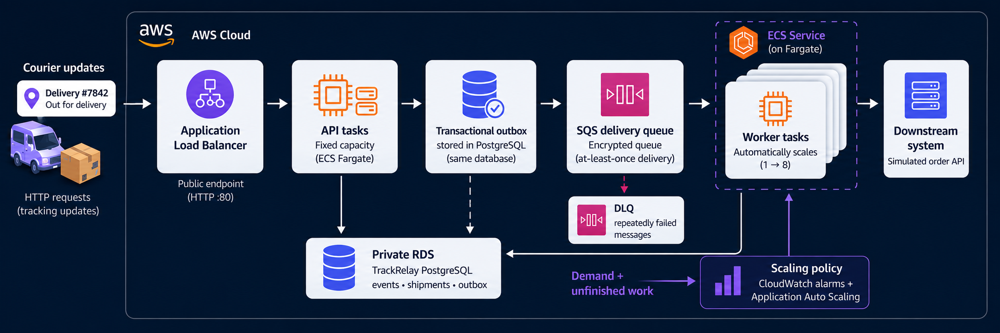

# TrackRelay

### Same demand. Less unfinished work with autoscaling.

TrackRelay is a shipment-event gateway: it turns courier updates into a consistent
event stream for an order-management system. It studies how cloud capacity can
adapt to demand while preserving reliable delivery.



**In one paired AWS experiment with the same 25-events/second peak, autoscaling
reduced maximum observed unfinished deliveries by 85%—from 3,583 to 529.
Workers scaled 1→8→1, and both runs delivered all 5,730 events correctly.**


## What changed when workers could scale?

Both runs used the same asynchronous application and traffic waveform. The
fixed run kept one worker. After resetting application state, the elastic run
enabled worker autoscaling. API, database, and simulator capacity stayed fixed.

| Observed in this pair | Fixed | Elastic |
| --- | ---: | ---: |
| Workers | 1 | 1→8→1 |
| Maximum sampled unfinished deliveries | **3,583** | **529** |
| Completed events/s during sampled peak | 6.29 | 25.65 |
| Maximum native oldest-message age | 405 s | 28 s |
| Worst full-phase ingestion p95 | 73.5 ms | 86.3 ms |
| Events delivered and reconciled | 5,730 / 5,730 | 5,730 / 5,730 |
| Missing events / duplicate effects / incorrect final states | 0 / 0 / 0 | 0 / 0 / 0 |

One worker fell behind while the API continued responding quickly. With scaling,
processing caught up with peak demand and unfinished work fell to a few events.
Eight workers were first observed about **85 seconds after demand increased**;
one worker was observed again about **175 seconds after low-demand recovery began**.
These are sampled service counts, not exact task transitions or billing times.

## Why the cloud matters

A queue separates accepting an update from delivering it. Workers can process
that queue independently, so delivery capacity can change while API capacity
stays fixed. CloudWatch signals drive ECS Service Auto Scaling, and Fargate runs
the worker containers. This experiment demonstrates acquiring extra worker
capacity when demand rises and releasing it after demand falls.

## What this result does—and does not—say

This was **one fixed-then-elastic pair on 16 September 2026**, using synthetic
courier events and a healthy downstream simulator. The 85% figure compares
maximum sampled unfinished events under this workload; it is not a capacity
multiplier or a cost-saving estimate.

Both runs passed ingestion and correctness requirements. The fixed run qualified
as a valid control but **failed several delivery/backlog load steps**. The elastic
run passed the peak step and the elasticity qualification, but did not pass every
step either. Both baseline steps failed the frozen capacity calculation, so the
report correctly publishes **no supported-rate multiplier**.

Latency here means API acceptance, not time to downstream delivery. Both runs
ultimately drained; that does not rescue failed load steps. The
[paired report](docs/paired-elasticity-report.md) explains startup effects,
sampling-sensitive failures, timing definitions, and the remaining limits.

Teardown was verified with **zero resources in all 30 tracked native inventory
categories**. The current evidence does not compare synchronous architecture,
measure maximum sustainable throughput, or establish lower cost.

## Explore or reproduce

- [Paired results and measurement notes](docs/paired-elasticity-report.md)
- [Public chart dataset](docs/assets/paired/data.json)
- [Active post-MVP plan](docs/implementation-plan-2_post-mvp.md) · [Architecture](docs/aws-async-architecture.md)
- [Run the paired experiment](docs/aws-elasticity-runbook.md) — requires preflight, a fresh plan, budget review, and session approval.
- [Earlier standalone demo](docs/autoscaling-report.md) · [Original implementation history](docs/implementation-plan.md)

The stack uses Python / FastAPI, PostgreSQL, SQS, ECS Fargate, CloudWatch,
Terraform and k6. Local checks do not provision AWS:

```shell
uv sync --locked
make test
make lint
```

Regenerate the paired figure from the committed dataset with AWS off:

```shell
uv run --locked python scripts/render_paired_results.py
```
