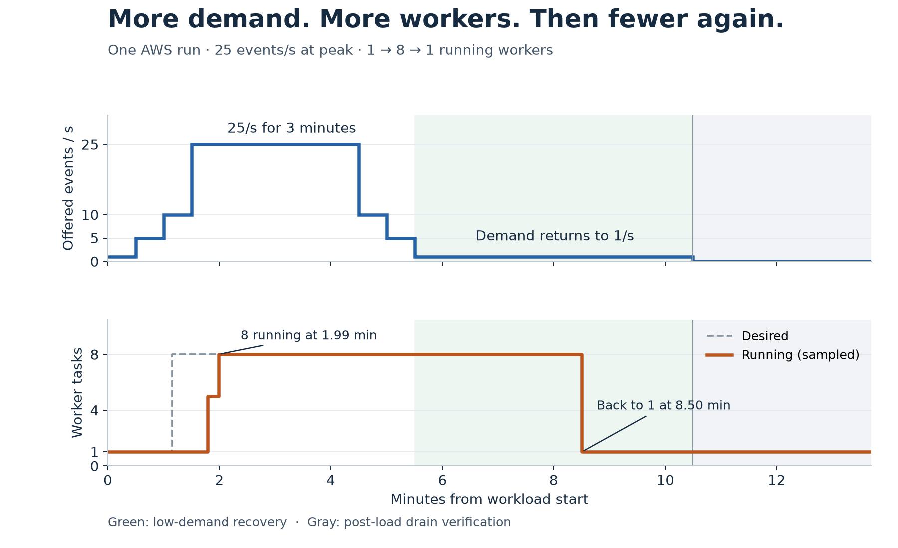
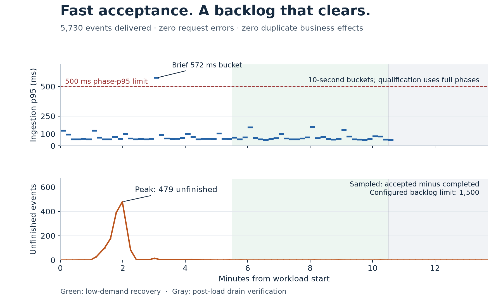

# TrackRelay

### More traffic. More workers. Fewer workers when traffic falls.

TrackRelay is a shipment-event gateway: it turns courier updates into a consistent
event stream for an order-management system. This project shows how moving
delivery work behind a queue lets cloud compute **expand and contract with demand**.

**In a 10½-minute AWS experiment, traffic rose from 1 to 25 events/second.
Workers automatically scaled from 1 → 8 → 1, and all 5,730 events were delivered.**



## What happened

The system started with one worker. As incoming traffic increased, the scaling
policy requested more capacity; eight workers were running about two minutes
after the workload began. When traffic returned to 1 event/second, the system
caught up and returned to one worker—without an operator changing the worker count.

| During the experiment | Observed result |
| --- | --- |
| Peak traffic | **25 events/s for 3 minutes** |
| Worker capacity | **1 → 8 → 1 tasks** |
| Ingestion p95 at peak | **79 ms** |
| Accepted and delivered | **5,730 / 5,730 events** |
| Request errors / dropped requests / duplicate effects | **0 / 0 / 0** |
| Largest sampled backlog | **479 unfinished events**, below the 1,500 limit |

## Why the cloud matters

A queue separates accepting an update from delivering it. Workers can process
that queue independently, so increasing delivery capacity does not require
rebuilding the API.

```text
Courier updates → API → durable outbox → SQS queue → workers → order system
                   │                                  ↑
                   └─ demand & unfinished work ─→ scaling policy
```

Here, CloudWatch signals drive ECS Service Auto Scaling, while Fargate runs the
worker containers. AWS supplies the underlying compute: TrackRelay's owner does
not need to buy, install, and maintain physical servers sized for the peak.
When demand stays low and little work remains, the policy reduces the worker
count again. See [ECS autoscaling](https://docs.aws.amazon.com/AmazonECS/latest/developerguide/service-auto-scaling.html)
and [Fargate](https://aws.amazon.com/fargate/).

That is the benefit demonstrated here: **access to more compute when needed,
and the ability to release extra worker capacity afterward.** Only workers
autoscale in this experiment; API and database capacity remain fixed.

## Did speed and delivery hold up?



Peak-phase ingestion p95 was **79 ms**, and every workload phase passed the
500 ms p95 limit. The backlog grew while workers were starting, then cleared.
Final reconciliation found no missing events or duplicate business effects.
Two delivery retries succeeded without duplicating the downstream action.

Latency here means **API acceptance**, not time to final downstream delivery.
One ten-second p95 bucket reached **572 ms**; the pass rule uses each entire
phase, not each bucket or individual request. The spike is retained in the plot.
Scaling is not instantaneous: this run returned to one worker about three minutes
after low-demand recovery began, including the two-minute quiet qualification
period and scaling delay.

## A measured demo, not a universal benchmark

This is one successful AWS run on **4 September 2026**, using synthetic courier
events and a healthy downstream simulator. It demonstrates bounded elasticity,
not maximum production throughput, measured cost savings, or an X× improvement
over the synchronous architecture. Those comparisons remain separate work.

All configured diagnostic guardrails passed. Afterward, teardown was verified
with **zero resources remaining in all 30 tracked inventory categories**.

## Explore or reproduce

- [Evidence, chart data and measurement notes](docs/autoscaling-report.md)
- [Architecture](docs/aws-async-architecture.md) · [Implementation history](docs/implementation-plan.md)
- [Run the AWS demo](docs/aws-elasticity-diagnostic-runbook.md) — requires a fresh plan, explicit budget approval and teardown.
- [Earlier setup and development notes](docs/archive/README-before-autoscaling.md) — archived technical reference.

The stack uses **Python / FastAPI, PostgreSQL, SQS, ECS Fargate, CloudWatch,
Terraform and k6**. Local checks do not provision AWS resources:

```shell
uv sync --locked
make test
make lint
```

Regenerate the charts from the committed, sanitized dataset without AWS access:

```shell
uv run --locked python scripts/render_autoscaling_readme.py
```
