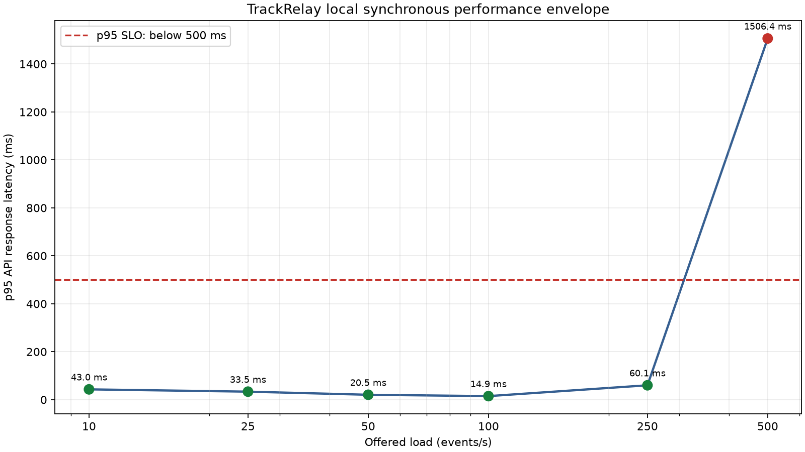

# TrackRelay

TrackRelay is a learning project about building and modernizing a reliable shipment-event integration gateway.

Fictional courier partners send shipment updates in different formats. TrackRelay authenticates, validates, and normalizes those updates, records them, updates the current shipment state, and delivers a consistent event to an internal order-management system.

The project begins as a deliberately synchronous application. Once that version is working and measured, it will be evolved in controlled stages into an asynchronous, observable, failure-tolerant system on AWS. The goal is not merely to produce a final architecture; it is to understand and demonstrate why each architectural change is useful.

## Core workflow

```text
Courier partner
    -> TrackRelay API
    -> authenticate and validate
    -> normalize partner payload
    -> detect duplicates and stale events
    -> persist event and update shipment state
    -> deliver normalized event downstream
```

The first shipment state machine will be intentionally small:

```text
CREATED -> PICKED_UP -> IN_TRANSIT -> OUT_FOR_DELIVERY -> DELIVERED
```

Shipment state is monotonic: an event may advance to any later status, allowing for missing intermediate courier updates, but cannot repeat or move backward. Older events are retained for audit with `state_applied = false` and reason `stale_event`, while the shipment remains unchanged. When occurrence timestamps are equal, the later status wins as a deterministic tie-breaker. `DELIVERED` is terminal; if an event is both older and terminal-conflicting, it is classified as stale first.

Inspect a shipment's complete audit history with `GET /api/v1/shipments/{tracking_number}/events`. Applied and rejected events are returned together in ascending `occurred_at` order, followed by `received_at`, database creation time, and event ID as deterministic tie-breakers. An unknown tracking number returns HTTP `404`.

## What the project demonstrates

- Adapting several external payload formats to one internal event model
- Idempotent processing of retried or duplicated events
- Safe handling of late and out-of-order events
- Controlled simulation of slow, failing, or unavailable dependencies
- Reconciliation that accounts for every generated event
- Repeatable load and failure experiments
- Incremental modernization from synchronous delivery to queue-based processing
- Evidence that cloud capacity can expand and contract automatically with demand

## Headline result goal

The project's primary result will demonstrate **cloud elasticity**, not merely that an asynchronous design is faster:

> **AWS-modernized TrackRelay automatically scaled from A to B worker tasks to absorb an X× traffic increase, kept p95 latency below 500 ms, accounted for every accepted event, and returned to A tasks after demand fell.**

The hero figure will align offered load, running worker tasks, queue depth, and p95 latency on one time axis. Scale-out will show that TrackRelay acquired processing capacity when demand rose; queue drain and scale-in will show that it caught up and released that capacity when demand fell. A run succeeds only while request errors remain below 1%, no requests are dropped or missing, every accepted event is accounted for, correctness guardrails pass, and the backlog remains bounded and drains within the experiment deadline.

The causal comparison will run the same queue-based AWS architecture twice: first with a fixed worker count and then with worker autoscaling enabled. SQS, ECS task definitions, RDS, the API capacity, workload, SLO, and minimum worker count will remain constant. Queue decoupling makes delivery independently scalable and exposes pending demand; autoscaling is the mechanism; AWS supplies and releases the underlying compute. Public cloud is not the only way to build an elastic platform, but it makes that capacity available on demand without TrackRelay's owner procuring and operating spare hardware beforehand.

Before that modernization, TrackRelay will run a smaller controlled cloud experiment: the same synchronous application, RDS configuration, healthy downstream, and workload on `t3.small`, `c7i-flex.large`, and `m7i-flex.large`. All three expose two vCPUs. The first transition tests rapid migration from economical burstable compute to a non-burstable compute-optimized profile; the second keeps processor generation and vCPU count fixed while moving to a memory-optimized profile. This demonstrates cloud hardware flexibility and workload matching without pretending to be the later autoscaling-elasticity result.

Phase 8 will still publish the local legacy latency-versus-load curve and capacity number. That is the project's first measurable end product and proves the benchmark and reconciliation machinery, but it is not the causal denominator for either cloud comparison. The vertical control must be rerun against RDS because the first cloud workload used host-local PostgreSQL.

### Local fixed-capacity reference

On the recorded local environment, synchronous TrackRelay sustained **250 events/s** while passing every latency, request-completion, reconciliation, duplicate-effect, and final-state guardrail. At the next configured point, 500 offered events/s, observed throughput remained about 243 events/s, 2,324 iterations were dropped, and p95 latency rose to 1,506 ms. This machine-specific result is the Phase 8 reference and benchmark rehearsal; the final cloud claim will come from the controlled fixed-versus-elastic AWS experiment.



See [the frozen baseline report](results/legacy-baseline/README.md) for the environment, exact values, and compact machine-readable evidence.

## Planned technology stack

### Application

- Python
- FastAPI and Pydantic
- SQLAlchemy and Alembic
- PostgreSQL
- HTTPX

### Testing and experiments

- pytest
- Ruff and static type checking
- A Python scenario generator
- A controllable FastAPI downstream simulator
- k6 load tests
- Reconciliation reports

### Later AWS stages

- EC2
- RDS for PostgreSQL
- SQS and a dead-letter queue
- ECS/Fargate and an Application Load Balancer
- ECR, CloudWatch, and Secrets Manager
- Terraform
- GitHub Actions with OIDC

These are Phase 9 tools, not prerequisites for running the completed local synchronous version.

### Phase 9 working model

AWS will remain off during ordinary development. TrackRelay code, container builds, experiment automation, and infrastructure definitions will be prepared locally; infrastructure as code will then create disposable environments for four bounded cloud sessions:

1. Validate the synchronous rehost and RDS setup, then tear it down.
2. Compare the RDS-backed synchronous system on three increasingly suitable EC2 tiers, then tear it down.
3. Validate the SQS worker and ECS/Fargate integration with tiny workloads, then tear it down.
4. Provision once, run the fixed-worker control and autoscaled-worker treatment back-to-back, collect the headline evidence, then tear it down.

The fourth session is one controlled experiment: application and infrastructure versions, API and database capacity, task definitions, benchmark driver, workload, and guardrails stay unchanged. Application state is reset between runs, and only the worker autoscaling policy changes. Every cloud session ends by verifying that its RDS instances, load balancers, ECS resources, NAT gateways if used, and other session-owned billable resources were removed.

Before any infrastructure exists, verify the non-secret local AWS configuration:

```bash
make aws-check
```

The command explicitly selects the `trackrelay-admin` profile and Asia Pacific (Jakarta), `ap-southeast-3`, instead of inheriting an unrelated `AWS_PROFILE`. It reads the profile's configured region and calls only STS `GetCallerIdentity`; it rejects the root user, does not print account identifiers, and does not create or modify resources. Another developer can override the non-secret defaults:

```bash
make aws-check \
  TRACKRELAY_AWS_PROFILE=another-profile \
  TRACKRELAY_AWS_REGION=another-region
```

AWS credentials remain in the developer's standard private AWS CLI configuration and must never be added to this repository.

### Synchronous API container

Stage 9.1 packages the unchanged synchronous API as a production-style OCI image. Build it locally from the locked Python dependencies:

```bash
make image-api
```

Run the reproducible smoke test:

```bash
make image-api-smoke
```

The multi-stage image installs TrackRelay non-editably, excludes development dependencies and build tooling from the runtime stage, runs as UID/GID `10001`, exposes port `8000`, and uses `/health/live` for its container health check. The smoke test starts the image on an ephemeral host port, waits for Docker health, verifies the liveness response and non-root UID, and removes the test container.

Database migrations remain an explicit one-off command using the same image rather than part of API startup:

```bash
docker run --rm \
  --env TRACKRELAY_DATABASE_URL='<database URL>' \
  trackrelay-api:local \
  alembic upgrade head
```

Do not place a real database URL in the Dockerfile, image, or Git. AWS deployment configuration will supply it at runtime through the planned secrets integration.

### Synchronous rehost runtime

The Stage 9.1 host runtime is defined in `deploy/rehost/compose.yaml`, independently of Terraform. It runs the same application image as a one-off Alembic migration, the API, and the private downstream simulator alongside host-local PostgreSQL. Only the API publishes a host port; PostgreSQL and the simulator remain inside the Compose network. The API cannot start until PostgreSQL is healthy, migrations succeed, and the simulator is healthy.

Validate interpolation and the Compose model without starting containers:

```bash
make rehost-config
```

With Docker running, execute the complete local lifecycle:

```bash
make rehost-smoke
```

The command builds the application image, creates a uniquely named Compose project with a temporary random database password, starts PostgreSQL, runs migrations, and waits for the simulator and API. It runs the same four-scenario private correctness helper used by the RDS checkpoint, then sends one additional Courier Alpha smoke event, verifies its downstream receipt, restarts PostgreSQL and the API, and proves that the event, delivery attempt, shipment, and migration revision remain correct. An exit trap removes the containers, network, and database volume on success or failure; failed runs print service state and logs before cleanup.

The normal command performs a fresh application build and resolves the pinned PostgreSQL digest. For diagnosis when a container registry is temporarily unavailable, an explicit `REHOST_SKIP_BUILD=true` escape hatch may use already-cached images, but it refuses a missing application image and is not the deployment path or a substitute for a fresh-image validation.

For a real runtime, copy `deploy/rehost/.env.example` to the ignored `deploy/rehost/.env`, replace the synthetic database password with a random URL-safe value, and select the exact application image. The committed example binds the API to `127.0.0.1`. Cloud deployment will explicitly use `0.0.0.0`, while Terraform restricts external access to the approved benchmark-driver `/32`.

Cloud image publication, SSM-based deployment, frozen-workload execution, and AWS teardown remain separate guarded workflows. Merely running a local command does not authorize or start AWS resources.

The image-publication, host-deployment, and portability-workload portions are prepared as `make aws-rehost-publish`, `make aws-rehost-deploy`, and `make aws-rehost-workload`. They cannot run before Terraform records an approved apply of the same clean Git revision. Publication builds only Linux AMD64, passes the temporary ECR password over standard input, and records an immutable image digest without persisting the repository URL or account identifier. Deployment uses that digest and SSM Run Command rather than SSH. Because AWS retains Run Command history and logs API activity, no password is included in its payload; the host generates its own synthetic database password and stores it mode `0600`.

The workload command runs all six frozen Step 8.6 rates from the approved local benchmark machine. Only the API is reached publicly. Preparation and reconciliation run through SSM inside the private Compose network, so neither PostgreSQL nor the simulator is exposed. The result bundle records k6, API runtime, and compact database/downstream evidence plus benchmark-driver and database placement; it does not save the temporary public API address. This Stage 9.1 result proves workload portability and rehearses the evidence pipeline—it is not the later autoscaling headline comparison.

`make aws-rds-deploy` is the guarded Stage 9.2 switch. It runs only after the host-local workload is collected, discovers the private endpoint and RDS-managed credential from the EC2 role, requires TLS, runs migrations, recreates the API against RDS, and verifies a real event survives an API restart. Neither the endpoint nor credential enters the SSM payload or local evidence.

`make aws-rds-correctness` is the next guarded checkpoint. It runs only after the RDS switch, executes the normal, duplicate, out-of-order, and downstream-outage scenarios from a one-off container inside the private Compose network, and saves one compact suite report under the ignored AWS session evidence directory. The report contains deterministic run identities, observed HTTP status codes, and reconciliation counts, but no database endpoint, credential, AWS account ID, or public API address.

Cloud session 1 exercised this complete sequence against AWS in Jakarta. The synchronous rehost sustained 25 events/s under the frozen workload and first failed its SLO at 50 events/s. After the RDS switch, all four core correctness scenarios passed reconciliation. The complete stack was then destroyed; Terraform state and every native resource inventory were empty. These remain cloud-mutating commands and every future session still requires its own explicit approval. The [rehost architecture note](docs/aws-rehost-architecture.md) describes the full sequence and security boundary.

Stage 9.3 will next recreate the synchronous API against fixed RDS and measure `t3.small`, `c7i-flex.large`, and `m7i-flex.large` under a healthy downstream. The application image, RDS, application concurrency, workload, simulator behavior, driver, and guardrails remain constant through a validated control artifact. The first transition is reported as burstable-to-compute-optimized migration; the second as compute-to-memory-optimized migration. Compose fixes the co-located simulator at one CPU and 1 GiB throughout, and a rate is attributable only while simulator measurements confirm headroom. The locally tested transition controller clears and verifies only synthetic experiment state, accepts only the exact next frozen tier, inspects the saved Terraform plan for one in-place EC2 update, and revalidates the unchanged host identity, RDS identity, image digest, TLS mode, and API readiness after restart. A local-only reporter then re-derives all three guarded envelopes, aligns the first-failure evidence by tier, rate, and run identity, and emits both transition comparisons plus a conservative bottleneck assessment. It marks censored capacity boundaries, multiple explanations, and constrained-simulator evidence instead of turning them into stronger claims. An explicitly armed session runner repeats the approved session ID, cost ceiling, tier order, and unconditional-teardown authorization before it can start; once armed, it owns the three treatments and report and attempts destroy plus native absence verification after success, failure, or a normal operator interrupt.

The Terraform root module in `infra/terraform` defines the rehost host and private RDS data layer: one x86_64 EC2 instance, a private single-AZ PostgreSQL instance, their disposable network, an ECR repository, RDS-managed credentials, and SSM access without SSH. The [rehost architecture note](docs/aws-rehost-architecture.md) explains the boundary, the earlier ARM cloud-session result, and the current x86_64 Stage 9.3 revision. Initialize its locked provider and run formatting, validation, and mocked plan assertions with:

```bash
make infra-init
make infra-check
```

Neither command provisions infrastructure or contacts AWS. The real plan and apply remain behind the documented cloud-session approval gate.

Every billable AWS session must follow the [AWS cloud-session checklist](docs/aws-cloud-session-checklist.md). A session is not complete until Terraform state is empty and native service checks confirm that no session-owned resources remain. The generic AWS tagging-index count is still saved, but AWS documents that it includes previously tagged resources, so deleted-resource tombstones are supporting evidence rather than authoritative absence checks.

The repository exposes `make aws-plan`, approval-gated `make aws-up`, unconditional `make aws-down`, and `make aws-verify-down`. Plans and lifecycle logs stay under the ignored `results/aws-sessions/` tree. The verifier checks Terraform state, the tagging API, and native EC2, EBS, VPC, ECR, IAM, RDS, backup, snapshot, and RDS-managed-secret inventories for all resources currently defined; each later resource type must add its own native check before use.

## Local development

[uv](https://docs.astral.sh/uv/) manages TrackRelay's Python interpreter, project environment, dependencies, and lockfile. The repository pins the local interpreter to Python 3.12 in `.python-version`. `uv` will use or install a matching interpreter when needed.

Synchronize the project-local `.venv` from the committed lockfile:

```bash
uv sync --locked --python 3.12
```

TrackRelay has safe defaults and runs without local configuration. To override them, copy the example environment file:

```bash
cp .env.example .env
```

The `TRACKRELAY_APP_NAME`, `TRACKRELAY_ENVIRONMENT`, and `TRACKRELAY_DEBUG` variables configure the application name, runtime environment, and debug mode. `TRACKRELAY_DOWNSTREAM_URL` and `TRACKRELAY_DOWNSTREAM_TIMEOUT_SECONDS` configure synchronous delivery. The local `.env` file is ignored by Git; `.env.example` documents non-secret example values.

### Local PostgreSQL

Docker Compose runs PostgreSQL independently of the API, so database startup can be learned and verified before application persistence is introduced. Start it with:

```bash
make db-up
```

Inspect its state:

```bash
make db-status
```

Check the application-configured SQLAlchemy connection:

```bash
make db-check
```

Apply every pending database migration:

```bash
make migrate
```

Inspect the database's current migration revision:

```bash
make migration-status
```

Alembic reads the same `TRACKRELAY_DATABASE_URL` setting as the application. The initial `0001_baseline` migration is deliberately empty because no domain tables exist yet; it establishes the starting point for later schema changes.

Run tests that exercise transaction behavior against PostgreSQL:

```bash
make test-integration
```

The default `make test` suite excludes tests marked `integration`, so it remains fast and does not require Docker. Run `make db-up` and `make migrate` before the integration suite.

Open an interactive PostgreSQL shell when you want to inspect it directly:

```bash
docker compose exec postgres psql -U trackrelay -d trackrelay
```

Stop the service without deleting its persistent data volume:

```bash
make db-down
```

Compose reads `POSTGRES_DB`, `POSTGRES_USER`, `POSTGRES_PASSWORD`, and `POSTGRES_PORT` from `.env`, with development defaults when the file is absent. TrackRelay defaults to host port `5433` to avoid conflicting with a separately installed PostgreSQL server; the container itself still listens on the standard port `5432`. SQLAlchemy reads `TRACKRELAY_DATABASE_URL`. Database infrastructure remains separate from the API routes; readiness will use it in Step 1.9.

Run the tests:

```bash
uv run --locked pytest
```

Run the linter:

```bash
uv run --locked ruff check .
```

Start the local API server:

```bash
uv run --locked uvicorn trackrelay.main:app --reload --host 127.0.0.1 --port 8000
```

Then visit `http://127.0.0.1:8000/docs` or check liveness with:

```bash
curl http://127.0.0.1:8000/health/live
```

Liveness reports whether the API process is responding. Readiness additionally checks whether PostgreSQL can execute a query:

```bash
curl --include http://127.0.0.1:8000/health/ready
```

Readiness returns HTTP `200` with `{"status":"ready"}` when PostgreSQL is available and HTTP `503` when it is unavailable.

A configured business partner submits an event to `POST /api/v1/partners/{partner_id}/events`; for example, an `alpha-indonesia` partner using the `courier-alpha` adapter posts to `/api/v1/partners/alpha-indonesia/events`. TrackRelay loads that partner, selects its configured payload adapter, normalizes and persists the event with its shipment update, then synchronously posts the normalized event to the downstream simulator. A successful response includes the event ID, processing and delivery statuses, and the downstream HTTP status code.

Synthetic experiment traffic can include an `X-Test-Run-ID` request header containing a UUID. TrackRelay keeps this laboratory metadata outside the courier-specific JSON, attaches it to the normalized event, stores it as an optional foreign key, and forwards it downstream. Ordinary courier traffic omits the header and retains a null `test_run_id`.

Each `test_runs` row records the scenario name, random seed, JSON configuration, expected event count, start time, and optional completion time. A scenario executor can populate this reproducibility boundary directly from the deterministic input manifest.

### Deterministic input manifests

Generate a small normal Courier Alpha dataset without sending any traffic:

```bash
make generate SEED=20260806 SHIPMENTS=3 OUTPUT=results/input-manifest.json
```

The same seed, partner, shipment count, and start time produce the same test-run UUID and byte-identical manifest. Pass `--test-run-id` directly to `uv run trackrelay-generate` when a fresh experiment needs a distinct namespace while retaining the same history shape.

The manifest contains every sendable partner payload together with its `test_run_id`, sequence number, partner event ID, tracking number, expected normalized status, and occurrence time. It also records the expected unique-event count and final state of every shipment. Generated partner event and tracking identifiers include the run UUID, so experiments given distinct run IDs use separate identity namespaces.

Generation is intentionally offline in this step: it writes the experiment inputs and expectations but does not alter PostgreSQL or call TrackRelay. Later scenario execution will persist the matching `test_runs` definition and send each payload with the `X-Test-Run-ID` header.

### Basic reconciliation

After every request in a manifest has been attempted, the matching `test_runs` definition exists, and the same downstream simulator process still holds its receipts, compare the manifest with TrackRelay's configured database and simulator:

```bash
make reconcile \
  MANIFEST=results/input-manifest.json \
  REPORT=results/reconciliation.json
```

The JSON report counts generated and accepted requests, rejected requests without a matching persisted identity, unique persisted events, and unique events in the `processed`, `failed`, or pending `received` states. It also reports simulator receipts, unique downstream events, duplicate business effects, and incorrect final shipment states. The command assumes every manifest request was attempted before reconciliation.

The reconciliation code names evidence after its source. A `manifest_event` is the declared input, a `database_event` is the persisted record, a `database_delivery_attempt` records an attempted downstream call, a `simulator_receipt` is the downstream system's evidence, and a `database_shipment` holds TrackRelay's final materialized state. It compares those sources in three stages:

1. Manifest events against database events.
2. Database delivery attempts against simulator receipts.
3. Manifest final shipment states against database shipments.

The `test_run_id` selects one experiment. Inside that experiment, `(partner_id, partner_event_id)` matches the same business event across the manifest, database, and simulator; `Event.id` joins a database event to its delivery attempts; and `tracking_number` groups event history into a shipment. These names and identities are intentionally explicit because “expected” and “actual” are ambiguous when every evidence source can contain either.

`unaccounted` identifies persisted run events that have no manifest identity, whose stored or received content disagrees with the manifest, or whose durable delivery attempts do not agree with simulator receipts. A failed delivery attempt with no receipt remains explicitly accounted for; a successful attempt without a receipt, or a receipt without a successful attempt, does not.

`invariants_passed` is true only when all four reconciliation invariants hold:

```text
unique = processed + failed + pending
unaccounted = 0
duplicate business effects = 0
incorrect final shipment states = 0
```

### Test-run database summaries

With the TrackRelay API running, save its persisted view of one experiment as versioned JSON:

```bash
make summary \
  TEST_RUN_ID=00000000-0000-0000-0000-000000000705 \
  SUMMARY=results/test-run-summary.json
```

This calls `GET /api/v1/test-runs/{test_run_id}/summary`. The response contains the run definition and timestamps, declared event count, database event counts by processing state, and database delivery-attempt counts by result. A known run with no events returns zero counts; an unknown run returns HTTP `404`.

The endpoint deliberately summarizes only evidence persisted by TrackRelay. Use the reconciliation command when the manifest, simulator receipts, duplicate effects, and final shipment correctness must also be compared.

### Repeatable correctness scenarios

Start PostgreSQL, apply migrations, and run the TrackRelay API and downstream simulator in separate terminals. Then execute any correctness scenario as a command:

```bash
make scenario-normal
make scenario-duplicate
make scenario-out-of-order
make scenario-downstream-outage
```

Each command creates a fresh test-run UUID, ensures the configured Courier Alpha partner exists, sends deterministic traffic, and stores its evidence under `results/correctness/<scenario>/<test_run_id>/`:

```text
input-manifest.json
request-observations.json
database-summary.json
reconciliation.json
```

The duplicate scenario sends each business identity twice and expects only the first request to create a database event or downstream effect. The out-of-order scenario sends every shipment history in reverse while expecting the final shipment state to remain delivered. The outage scenario switches the simulator to `UNAVAILABLE`, expects persisted events with HTTP-error delivery attempts, and restores the simulator to `HEALTHY` afterward.

Every command runs reconciliation before it succeeds. It exits unsuccessfully after saving the evidence if the observed HTTP statuses disagree with the scenario or any reconciliation invariant fails. Override `SEED`, `SHIPMENTS`, `API_URL`, or `CORRECTNESS_OUTPUT` through Make variables when needed.

### k6 smoke test

With the TrackRelay API running, send five liveness requests from one virtual user and save k6's machine-readable end-of-test summary:

```bash
make load-smoke
```

The command runs the pinned `grafana/k6:2.1.0` container, so a host installation of k6 is not required. It writes the summary to `results/k6/smoke-summary.json`; override `K6_OUTPUT` to choose another local path. The container reaches the API through `http://host.docker.internal:8000`, which can be changed with `K6_API_URL`.

This deliberately small test checks only that k6 can reach TrackRelay, all liveness checks pass, and result capture works. It does not yet define a latency or request-error SLO. The script uses k6's [`handleSummary()`](https://grafana.com/docs/k6/latest/results-output/end-of-test/custom-summary/) hook so the raw aggregate metrics remain available for later experiment steps.

### Initial local baseline SLO

The first performance baseline uses three deliberately simple pass conditions:

| Signal | Evidence | Pass condition |
| --- | --- | --- |
| Response latency | k6 `http_req_duration` | `p(95) < 500 ms` |
| Request errors | k6 `http_req_failed` | `rate < 0.01` (below 1%) |
| Accepted-event accounting | Reconciliation report | `unaccounted == 0` |

The comparisons are strict: exactly 500 ms or exactly 1% fails. These k6 metric expressions follow its standard [threshold syntax](https://grafana.com/docs/k6/latest/using-k6/thresholds/). The accounting target comes from the matching test run's reconciliation report because k6 cannot determine whether an accepted request produced consistent database and downstream evidence.

`INITIAL_BASELINE_SLO` in `trackrelay.experiments.slo` is the machine-readable definition. `evaluate_baseline_slo()` distinguishes `slo_passed`, meaning the three targets above passed, from `experiment_passed`, which also requires `reconciliation.invariants_passed`. Therefore duplicate business effects or incorrect final shipment states still make the complete experiment fail even when its latency, error rate, and unaccounted count meet the SLO.

This is an initial local experiment definition for finding the synchronous architecture's limits. It is not a promised production target; later evidence and business requirements may justify revising it. The gradual ramp below applies it while increasing ingestion traffic.

### Gradual ingestion ramp

With PostgreSQL migrated and both TrackRelay and the downstream simulator running, execute the standard arrival-rate ramp:

```bash
make load-ramp
```

The command first creates or validates an active `load-alpha` partner, then sends unique Courier Alpha events at 10, 25, 50, 100, 250, and 500 requests per second. Each tier lasts 10 seconds by default. The open-model k6 [arrival-rate executor](https://grafana.com/docs/k6/latest/using-k6/scenarios/executors/constant-arrival-rate/) starts requests independently of response completion, so the configured rate remains the input while TrackRelay's response time is the observation.

Each tier has its own p95-latency and request-error thresholds from the initial SLO. A tier failure aborts the remaining higher rates; dropped iterations and non-`201` responses also fail the run. The machine-readable k6 summary is saved to `results/k6/ramp-summary.json`.

Use shorter tiers for a wiring check, or override the rates when diagnosing a constrained machine:

```bash
make load-ramp RAMP_TIER_DURATION_SECONDS=1 RAMP_RATES=1,2
```

`RAMP_PARTNER_ID`, `RAMP_RUN_ID`, `K6_API_URL`, and `K6_RAMP_OUTPUT` are also configurable. When `RAMP_RUN_ID` is omitted, the command generates a UUID used only to keep synthetic event and tracking identities unique.

The standalone ramp evaluates the k6-observable latency and error targets. The experiments below add the run manifest, reconciliation, resource measurements, and `experiment_passed` evaluation needed to prove the accounting and correctness side of the SLO.

### Downstream failure under load

With the same local services running, execute the repeatable slow-downstream and outage experiments:

```bash
make load-slow
make load-outage
```

Both commands default to 5 requests per second for 5 seconds. Override `LOAD_RATE`, `LOAD_DURATION_SECONDS`, or `PERFORMANCE_OUTPUT` as needed. Rate multiplied by duration must be divisible by five because the manifest retains one complete five-state history for every synthetic shipment. The runner also requires k6's observed HTTP-request count to equal that declared manifest count before it considers the execution valid.

Each command performs the complete experiment lifecycle:

1. Generate a fresh test-run UUID and immutable Courier Alpha manifest.
2. Register the matching partner and test-run definition in PostgreSQL.
3. Put the downstream simulator into `SLOW` or `UNAVAILABLE` mode.
4. Run fixed-rate k6 traffic while sampling TrackRelay's read-only runtime metrics endpoint.
5. Restore the simulator to `HEALTHY` even after a load-run error.
6. Save database and simulator evidence, reconcile it, and evaluate the baseline SLO.

Evidence is grouped under `results/performance/<scenario>/<test_run_id>/`:

```text
configuration.json
input-manifest.json
k6-summary.json
runtime-metrics-samples.json
database-summary.json
simulator-receipts.json
reconciliation.json
experiment-result.json
```

The raw k6 summary supplies latency, errors, and observed throughput. Runtime samples record cumulative API-process CPU time, maximum resident memory, and SQLAlchemy pool connections. The final result derives CPU consumed during the run, observed memory, maximum open and checked-out connections, downstream deliveries per second, delivery receipts per accepted event, reconciliation, and the SLO interpretation.

These are intentionally failure experiments. Slow delivery should normally cross the 500 ms latency target, while unavailability should produce an HTTP error rate far above 1%. A correctly functioning experiment can therefore have `execution_valid: true` and reconciled evidence while `complete_experiment_passed` is false. That distinction demonstrates the synchronous architecture's limitation without misclassifying accounted failures as lost events.

### Frozen legacy performance envelope

The Step 8.6 baseline reuses the complete experiment lifecycle under a healthy downstream condition and evaluates 10, 25, 50, 100, 250, and 500 offered events per second independently. Each request creates one distinct shipment in the `CREATED` state. This avoids manufacturing concurrent updates to the same shipment while preserving a manifest-declared final state for every request. The separate correctness scenarios remain responsible for exercising complete five-state histories and ordering behavior.

For the recorded single-process topology, run both servers without development reload or access-log overhead:

```bash
uv run --locked uvicorn trackrelay.downstream.main:app \
  --host 127.0.0.1 --port 8001 --no-access-log
```

```bash
uv run --locked uvicorn trackrelay.main:app \
  --host 127.0.0.1 --port 8000 --no-access-log
```

Use a freshly migrated, dedicated PostgreSQL database when producing an authoritative result, and expose the same `TRACKRELAY_DATABASE_URL` to both the API and baseline command. Then run:

```bash
make load-baseline
```

The command runs the pinned k6 container once per rate, waits for server-side work to settle, reconciles each test run independently, and writes the compact artifact under `results/legacy-baseline/`:

```text
benchmark-definition.json
summary.json
ramp-results.csv
latency-vs-load.png
README.md
```

Per-run manifests, k6 summaries, runtime samples, database summaries, simulator receipts, and reconciliation reports are stored under `results/raw/legacy-baseline/` and ignored by Git. Override `BASELINE_RATES`, `BASELINE_TIER_DURATION_SECONDS`, `BASELINE_OUTPUT`, or `BASELINE_RAW_OUTPUT` through Make variables for diagnostics; the versioned reference uses the defaults.

### Duplicate-event contract

A logical event is identified by `(partner_id, partner_event_id)`. Multiple HTTP requests carrying that identity are transport retries of the same logical event, not additional events. Likewise, a downstream HTTP delivery is a side effect of the logical event; retrying ingestion must not create another downstream delivery.

The first successful request returns HTTP `201` with `duplicate: false`. An already-seen event returns HTTP `200` with the original `event_id`, `duplicate: true`, `delivery_status: "skipped_duplicate"`, and `downstream_status_code: null`. Sequential and concurrent uniqueness conflicts resolve to the original event without repeating the shipment update, and duplicate requests skip downstream delivery.

Start the downstream order-system simulator in a separate terminal:

```bash
make run-downstream
```

It listens on `http://127.0.0.1:8001`. `POST /events` validates and records a normalized event in memory, while `GET /events` makes the received events inspectable. The store is intentionally process-local and resets whenever the simulator restarts.

The simulator starts in `HEALTHY` mode. Change behavior with `PUT /control/mode`; `GET /control/status` reports the active mode and fixed delay. `RETURN_500` returns HTTP `500`, `SLOW` waits 1 second and accepts, `TIMEOUT` waits 6 seconds and accepts, and `UNAVAILABLE` returns HTTP `503`. Failed or unavailable requests are not recorded. Use `{"mode":"HEALTHY"}` to restore normal acceptance. Control state is process-local and resets to `HEALTHY` when the simulator restarts. The 6-second timeout delay intentionally exceeds TrackRelay's default 5-second downstream timeout; the server can still finish and record after the client gives up, a synchronous ambiguity explored in later steps.

TrackRelay stores every actual downstream call in `delivery_attempts`, separate from the logical `events` row. Each attempt records its per-event attempt number, result (`delivered`, `http_error`, or `transport_error`), optional HTTP response code, latency in milliseconds, optional error text, and start/completion timestamps. Duplicate ingestion requests do not make downstream calls and therefore do not create delivery attempts.

### Downstream-failure transaction boundary

Event persistence and downstream delivery do not share a transaction. Once normalization succeeds, TrackRelay commits the logical event and any shipment-state change before attempting delivery. The delivery-attempt record then commits independently, so both records remain inspectable even when the HTTP request reports a downstream failure. TrackRelay does not automatically retry delivery inside the ingestion request.

A downstream HTTP error or non-timeout transport error returns HTTP `502` with `{"detail":"Downstream delivery failed; event remains persisted"}`. A downstream timeout returns HTTP `504` with `{"detail":"Downstream delivery timed out; event remains persisted"}`. These responses describe delivery failure, not persistence failure: the event, shipment state, and failed attempt remain stored.

The Phase 5 outage scenario sends three distinct events while the simulator is `UNAVAILABLE`. All three API calls return `502`, yet PostgreSQL retains three processed events, three shipment updates, and three HTTP-error attempts with downstream status `503`; the simulator receives no events. Retrying the same payloads returns the existing event IDs with HTTP `200` and `skipped_duplicate`, without creating more attempts. This prevents duplicate side effects but does not recover the missed deliveries—a deliberate measurement of the legacy synchronous design.

Inspect a shipment's latest accepted state with `GET /api/v1/shipments/{tracking_number}`. A found response includes its tracking number, current normalized status, the business timestamp of that status, and creation/update timestamps. An unknown tracking number returns HTTP `404` with `{"detail":"Shipment not found"}`. Append `/events` to retrieve the shipment's complete applied and rejected event history.

Inspect one logical event with `GET /api/v1/events/{event_id}`. The response combines its normalized payload, processing status, shipment-state application decision, and every delivery attempt ordered by attempt number. Attempt diagnostics include result, downstream response code, latency, error text, and start/completion timestamps. An unknown UUID returns HTTP `404` with `{"detail":"Event not found"}`.

Every courier adapter implements the shared `PartnerAdapter` protocol: it declares a stable `adapter_type`, exposes its Pydantic `payload_model`, and normalizes a validated payload plus the configured business-partner ID and receipt time into a `NormalizedEvent` without I/O. The registry is keyed by adapter type, and ingestion selects it through `Partner.adapter_type`; `Partner.id` remains the event's business identity. This allows records such as `beta-indonesia` and `beta-singapore` to share the `courier-beta` payload adapter while retaining separate idempotency namespaces. A reusable contract-test suite verifies this separation, shared identifiers and timestamps, raw-payload preservation, and all normalized shipment-status mappings.

Courier Beta uses its external field names `messageId`, `awb`, `statusCode`, and `timestamp`. Status codes `10`, `20`, `30`, `60`, and `72` map respectively to created, picked up, in transit, out for delivery, and delivered; `72` and the canonical sample come from the original project design, while the preceding monotonic codes are TrackRelay's documented local simulator contract. `timestamp` is a positive Unix timestamp in seconds. Both numeric fields are strict integers, and the adapter preserves the original external field names in `raw_payload`.

Courier Gamma nests its external contract under `notification`: `reference`, `trackingNumber`, `status`, and `occurredAt`. The timestamp must be an aware ISO 8601 value with a zero UTC offset, such as `2026-08-06T07:21:00Z`; naive or non-UTC offsets are rejected. Gamma uses the five normalized status names as its external codes and preserves the complete nested object in `raw_payload`.

The equivalent application shortcuts are `make sync`, `make test`, `make lint`, and `make run`. Activating `.venv` manually or setting `PYTHONPATH` is not required because TrackRelay is installed as a project package.

## Development approach

TrackRelay will be built in very small, observable steps. Each step should:

1. Introduce one idea or one narrow behavior.
2. Explain why that behavior exists.
3. Add or update a focused test.
4. Leave the repository in a runnable state.
5. Produce a result that can be inspected before moving on.

The first vertical slice supports Courier Alpha events from HTTP request through database persistence, shipment updates, and downstream delivery. It treats retries idempotently and retains out-of-order events without reversing shipment state. Performance testing and AWS will be added afterward.

See [docs/implementation-plan.md](docs/implementation-plan.md) for the step-by-step roadmap.

## Current status

The local synchronous implementation is complete and measured through Step 8.6. Its frozen reference sustains 250 events/s on the recorded machine and first fails at 500 events/s. Phase 9 cloud session 1 has validated the synchronous rehost and RDS correctness and has been fully torn down. Stage 9.3 now prepares the controlled RDS-backed hardware-flexibility experiment; the first queue boundary for Stage 9.4 is also complete.
