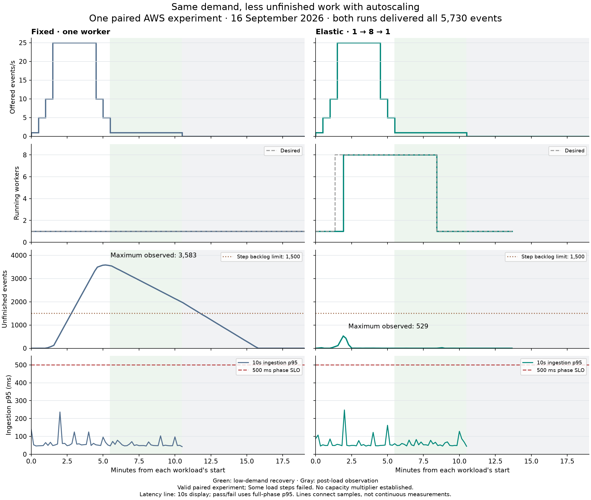

# Fixed versus elastic workers: same demand, less unfinished work

One paired AWS experiment on **16 September 2026** compared one fixed worker
with automatic 1→8→1 worker scaling. Each treatment received the same 10½-minute
waveform, including 25 events/s for three minutes. Both delivered and reconciled
all 5,730 events. Autoscaling reduced the **maximum sampled unfinished events
from 3,583 to 529**, a reduction of **85.2%** in this pair.



## What the comparison establishes

| Measurement | Fixed | Elastic |
| --- | ---: | ---: |
| Worker counts | 1 throughout | 1→8→1 |
| Maximum sampled unfinished events | 3,583 | 529 |
| Maximum native oldest-message age | 405 s | 28 s |
| Completed events/s in the sampled peak window | 6.289 | 25.651 |
| Change in unfinished events across that peak window | +3,196 | −112 |
| Peak-phase ingestion p95 | 66.9 ms | 55.9 ms |
| Worst full-phase ingestion p95 | 73.5 ms | 86.3 ms |
| Accepted / completed / unique downstream effects | 5,730 / 5,730 / 5,730 | 5,730 / 5,730 / 5,730 |
| Dropped iterations / request errors / duplicate effects | 0 / 0 / 0 | 0 / 0 / 0 |
| Post-load stable-empty suffix begins | 323.9 s after actual load end | 0.017 s after actual load end |
| 180-second stable drain confirmed | 506.2 s after actual load end | 183.3 s after actual load end |

The fixed worker accumulated delivery work while the API continued responding
quickly. The elastic treatment processed slightly more than incoming peak demand
in its sampled window as it caught up on earlier work. It passed the peak step's
completion/backlog rules, while the fixed treatment failed them. The 25.651/s
value includes earlier arrivals; it is not a maximum sustainable throughput.

Eight desired/running workers with none pending were first observed **115.308
seconds after elastic load start**, or **85.308 seconds after the first scheduled
demand rise**. Return to one was observed at **505.474 seconds**, or **175.474
seconds after recovery began**. These are sampled service counts, not exact
transition or billing timestamps.

All reconciliation invariants passed: no failed, pending or unaccounted events,
no duplicate business effects, and no incorrect final shipment states. One
elastic delivery retry succeeded without creating another business effect.
The fixed control and elastic demonstration both qualified. This does **not**
mean every demand step passed: fixed overload is an intended comparison outcome.

## Why there is no capacity multiplier

The frozen `short-plateau-completion-v4` method requires every occurrence of a
rate to pass, and stops its consecutive envelope at the first unsupported rate.
Both treatments failed the baseline rate calculation. Higher passing steps
remain visible but cannot restore a capacity claim.

| Step | Fixed | Elastic |
| --- | --- | --- |
| Baseline 1/s | Fail: measured completion rate below 1/s | Fail: completion rate and backlog growth |
| Rise 5/s | Pass | Pass |
| Rise 10/s | Fail: completion rate and backlog growth | Fail: completion rate and backlog growth |
| Peak 25/s | Fail: completion rate, backlog growth and bound | Pass |
| Fall 10/s | Fail: completion rate, backlog growth and bound | Pass |
| Fall 5/s | Fail: backlog bound | Fail: completion rate and backlog growth |
| Recovery 1/s | Fail: backlog and message-age bounds | Fail: completion rate |

The retained samples explain several of these failures:

- **Fixed baseline:** samples at 0.019 and 23.513 seconds contain 0 and 20
  completed events, respectively: 20 / 23.494 = **0.851/s**. Accepted counts are
  also 0 and 20, with no unfinished events at either endpoint. The first recorded
  request ends around 3.850 seconds after load start. Including startup before
  traffic in this short sampled window depresses the measured rate; this is
  not evidence that one worker cannot sustain 1/s.
- **Elastic baseline:** 22 accepted events and zero completions were observed at
  24.786 seconds; by 35.969 seconds, 44 of 45 accepted events were completed.
  There is an observed early delivery delay, beyond a small rounding effect.
  Its cause has not been established by this report; do not attribute it to
  worker startup, SQS polling, or another mechanism without further evidence.
- **Elastic fall-5:** completed rate **4.955/s**, with one additional unfinished
  event between sampled endpoints. This fails the exact 5/s and non-growth rules.
- **Elastic recovery:** completed rate **0.998/s**, with unchanged outstanding
  count between endpoints. Finite event counts over a non-integer observation
  window can miss an exact nominal-rate threshold even while work keeps up.
  This is a measurement sensitivity, not permission to round a failure to pass.

This waveform captures scaling transients and carryover from earlier steps.
It was not an independent, settled capacity staircase. No thresholds, windows,
or conclusions in the saved report were changed after observing these results.
A future capacity protocol should explicitly handle settling and event/window
alignment before a new run; it cannot supply a retroactive multiplier here.

## What “backlog cleared” means here

During the latter part of the elastic peak, samples at 185–265 seconds retain
2–5 unfinished events. That is a small amount of ongoing delivery work, not
zero work. The frozen diagnostic requires a 60-second suffix with **zero**
unfinished events through the sampled peak end, so peak-clearance timing is
correctly unavailable. Use “caught up with peak demand” or “backlog reduced to
a few events,” not “the queue was continuously empty.” Post-load stable drain
is separately established in both treatments.

## Reading and reproducing the figure

Columns share time and value scales. Offered load follows the scheduled
waveform. Worker counts and unfinished events use actual observations, with
lines as visual guides and breaks for gaps above 30 seconds. Unfinished events
means persisted minus completed events; it is not SQS visible-message count.
The 85.2% reduction uses each treatment's maximum of this same sampled measure:
`100 × (1 − 529 / 3583)`. Sampling may miss a higher instantaneous peak.

Latency is HTTP ingestion/acceptance, not event-to-downstream completion.
Ten-second p95 displays retain sample counts in the dataset. The 500 ms gate
uses full-phase p95, not each display bucket. Green marks low-demand recovery;
gray marks scheduled post-load time. Actual controller load-end timestamps are
about 5–6 seconds later than scheduled load end; drain timings use those actual
end timestamps. Lines stop when each treatment's observations stop.

The [public numeric dataset](assets/paired/data.json) contains selected schedule,
observations, timing buckets, phase results, reconciliation counts, and source
hashes. It excludes raw AWS responses, endpoints, account identifiers, request
payloads, and logs. The local evidence loader revalidates the pair, policy/reset
chain, qualification, and teardown; export additionally rebuilds the saved
report and requires an exact match, including source hashes. The subset lets
readers reproduce the chart, not independently rerun every qualification check.

```shell
uv run --locked python scripts/render_paired_results.py
```

To rebuild the subset from retained local session evidence:

```shell
uv run --locked python scripts/render_paired_results.py \
  --session-dir results/aws-sessions/cloud-session-4-20260916T090513Z
```

Both operations run locally with AWS off. The original session and generated
comparison report remain unchanged under Git-ignored `results/aws-sessions/`.
Application revision: `132493a44fc3e92fae0b134f88806b079fc90654`. Session:
`cloud-session-4-20260916T090513Z`. Workload v6 / policy v6. All six cloud phases
completed without journaled workflow, cleanup, or diagnostic errors. Teardown
was verified at **2026-09-16 10:01:22 UTC**, with zero resources in all 30 tracked
native inventory categories. This is retained teardown evidence, not a fresh
live AWS inventory query.

## Limits and next work

This is one ordered fixed-then-elastic pair with synthetic events and a healthy
simulator. It shows a workload-specific backlog benefit and automatic resource
release. It does not establish repeatability, per-event delivery-latency
percentiles, maximum capacity, cost savings, or superiority over synchronous
architecture. Preserve this result and its failures. The separate matched
capacity study will define shared completed-delivery requirements and suitable
measurement windows before execution.

See the [paired protocol](post-mvp-paired-protocol.md),
[reporting rules](post-mvp-reporting-contract.md), and the
[earlier standalone demo](autoscaling-report.md).
